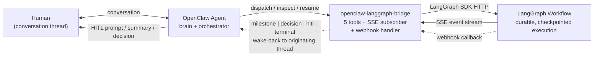

# openclaw-langgraph-bridge

An [OpenClaw](https://openclaw.dev) plugin that lets any agent drive [LangGraph](https://github.com/langchain-ai/langgraph) workflows from inside a conversation thread — with per-thread isolation, live event streaming, HITL gate support, and proactive wake-back when workflows emit milestones or reach a terminal state.

The agent stays in control of the conversation. The plugin handles the wire protocol.

---

## Why this exists

**The problem.** Agents asked to own multi-step, long-running execution work become brittle. Same inputs, different outputs. Context windows bloat with execution detail right when you need the agent reasoning sharpest — at approval gates, at production decisions. When something fails three steps into a five-step task, there is no checkpoint to resume from; the agent re-reasons the whole chain with a polluted context. And "what exactly did the agent do?" is answered only by scrolling through the chat history.

The root cause is structural: *a reasoning surface is not a reliable execution engine.* Asking it to be both overloads both roles.

**The architecture.** This plugin enables a clean split: the OpenClaw agent remains the brain and orchestrator — it holds context, makes decisions, talks to humans, and decides *when* to delegate — while LangGraph workflows handle the heavy lifting: discrete nodes, durable checkpointed state, deterministic shape, full observability. The agent dispatches work, then yields. The plugin streams events back over SSE, and wakes the agent in the originating conversation thread when a decision, milestone, HITL gate, or terminal event arrives.

The split is the point: *the agent stops being asked to be a reliable executor; the process stops being asked to be smart.* Each does what it is actually good at.

(see [docs/business-case.md](./docs/business-case.md) once available)

---

## Quick start

See **[docs/installation.md](./docs/installation.md)** for the full per-bot install runbook: tarball download, plugin config, gateway config, and verification steps.

---

## Tools

The plugin surfaces five tools to the agent:

| Tool | Description |
|---|---|
| `langgraph_list_workflows` | Discover what workflows the LangGraph server exposes (with `allowed: true/false` per any configured allowlist). |
| `langgraph_inspect_workflow` | Read a workflow's input schema before dispatching — use this to validate your input shape. |
| `langgraph_dispatch` | Start a new workflow run. Returns a `flow_id` once LangGraph has accepted the run; the agent can then yield and be woken on events. |
| `langgraph_inspect` | Read the current state of an in-flight or completed run. Defaults to the latest flow in the current session. |
| `langgraph_resume` | Resume a workflow paused at a HITL interrupt. Normalizes common replies (`approve`, `block_revise: ...`) into a typed payload. |

---

## Architecture



- Each conversation thread is its own session → its own agent instance with no shared state
- `status` events update flow state silently (no agent wake)
- `milestone`, `decision`, `hitl`, and `terminal` events wake the agent in the originating thread via the `openclaw agent` CLI primitive
- HITL resume opens a new SSE subscriber so post-resume events continue to wake the agent (not fire-and-forget)
- A terminated-flow guard drops replay frames after `graph:end` so consumers don't double-fire `resume` on stale interrupts

---

## Status

> **v0.13.0+** — OSS readiness in progress. Five tools ship and are validated end-to-end. Active known issues are tracked at [github.com/ggettert/openclaw-langgraph-bridge/issues](https://github.com/ggettert/openclaw-langgraph-bridge/issues). See [docs/installation.md → Known issues](./docs/installation.md#known-issues) for the current list.
>
> **Channel compatibility:** Tested against Slack (DM + channel threads). Other OpenClaw channels are theoretically supported — the wire protocol and wake primitive are channel-agnostic — but only Slack has been validated end-to-end. See [docs/installation.md → Supported channels](./docs/installation.md#supported-channels) for the compatibility matrix and how to add support for a new channel.

---

## Why not MCP?

LangGraph Server natively exposes a `/mcp` endpoint, so the obvious question is "why not register it as an MCP server?"

For one-shot dispatch with no streaming, no HITL, and no per-thread routing: MCP works fine. Use it.

Where this plugin earns its place is everything *after* the initial call: mid-run milestone events, HITL interrupt and resume, per-thread flow isolation, and proactive wake-back. MCP's `tools/call` is request/response — there is no protocol for in-flight events, no way to wake the agent when a workflow pauses at a gate, and no model for per-session flow binding.

See **[docs/why-this-not-mcp.md](./docs/why-this-not-mcp.md)** for the full comparison.

---

## Configuration

Keys live under `plugins.entries.openclaw-langgraph-bridge.config` in `~/.openclaw/openclaw.json`:

| Key | Required | Default | Description |
|---|---|---|---|
| `langgraphBaseUrl` | ✓ | — | Base URL of your LangGraph server (e.g. `http://langgraph.example.local:2024`) |
| `callbackToken` | ✓ | — | Bearer token expected on inbound webhook POSTs |
| `callbackPublicBaseUrl` | — | — | Public base URL the LangGraph server will POST events to. Plugin appends `/plugins/openclaw-langgraph-bridge/events` |
| `agentId` | — | `"main"` | Agent id to wake on events |
| `allowedWorkflows` | — | `[]` (all) | Optional allowlist of assistant ids / graph ids the agent may dispatch |
| `defaultTimeoutMs` | — | `10000` | Per-request timeout for the LangGraph HTTP client |

---

## Build from source

```bash
npm ci
npm run build
npm test
```

Requires Node 22+. Tests cover SSE frame classification, payload normalization, event routing, and dispatch streaming.

---

## License

Apache 2.0. See [LICENSE](./LICENSE).
